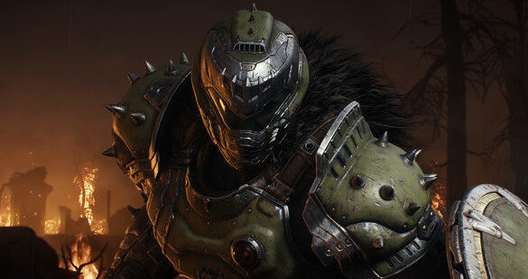

# Welcome to the Gaming Landscape

Explore the latest in gaming adventures:

## Navigation

- [Home](index.html)
- [GTA 6: Cruising for Leaks, News, and Maybe Even Love?](gta6.html)
- [Doom: The Dark Ages - A Slayer's Saga Forged in Rumors and Revelation](doom.html)

---

## Welcome to the Gaming Landscape

Explore the latest in gaming adventures:

### GTA 6: Cruising for Leaks, News, and Maybe Even Love?

[GTA 6: Cruising for Leaks, News, and Maybe Even Love?](gta6.html)

### Doom: The Dark Ages - A Slayer's Saga Forged in Rumors and Revelation

[Doom: The Dark Ages - A Slayer's Saga Forged in Rumors and Revelation](doom.html)

---

## Home Page Content

Welcome to the Gaming Landscape! Dive into the world of the most anticipated games and get the latest updates.

### GTA 6

Buckle up, gearheads! We're taking a deep dive into the world of Grand Theft Auto 6. It's been a wild ride since Rockstar finally confirmed the game's existence in February 2022, leaving a trail of breadcrumbs – leaks, rumors, and a single, glorious trailer that's been analyzed by fans more meticulously than a stolen sports car.

[Read more...](gta6.html)

### Doom: The Dark Ages

A fiery inscription burns across the gaming landscape: Doom: The Dark Ages. Calling all DOOM Slayer disciples, for a new crusade beckons! While details emerge from the molten core of development, whispers and official pronouncements intertwine, painting a tantalizing picture of the Slayer's next conquest.

[Read more...](doom.html)
